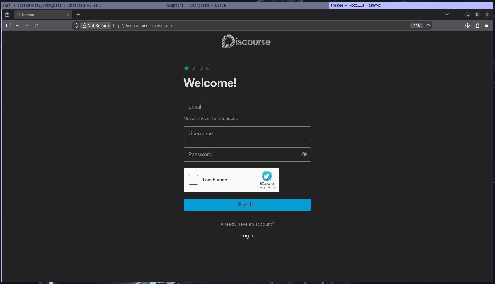

# Discourse Setup and Anti‑Spam Hardening

This guide provides guide to setup Discourse and anti‑spam mitigations.

## 1. System Setup

### Update Packages and Install Prerequisites

```sh
sudo dnf update -y
sudo dnf install -y git dnf-plugins-core
```

### Install Docker Engine

```sh
sudo dnf config-manager --add-repo https://download.docker.com/linux/rhel/docker-ce.repo
sudo dnf install docker-ce docker-ce-cli containerd.io docker-buildx-plugin docker-compose-plugin -y
sudo systemctl enable --now docker
```

## 2. Install Discourse

### Clone Discourse Docker

```sh
sudo -s
git clone https://github.com/discourse/discourse_docker.git /var/discourse
cd /var/discourse
chmod 700 containers
```

### Launch the setup tool at

```sh
./discourse-setup
# Answer the following questions when prompted:
Hostname for your Discourse? [discourse.example.com]: 
Email address for admin account(s)? [me@example.com,you@example.com]: 
SMTP server address? [smtp.example.com]: 
SMTP port? [587]:
NOTIFICATION_EMAIL:
```

This will update the containers/app.yml

Verify if the container is up
```sh
docker ps
```

## 3. Anti-Spam Migitation

Create an admin account and login to your admin account

### User permissions

Navigate to  http://{your_discuss_domain}/admin/config/trust-levels

- Set `Default trust level` to `0: new user`
- Set `Default invitee trust level` to `0: new user`

Navigate to http://{your_discourse_domain}/admin/site_settings/category/login

- Enable `Must approve users` 
### Email verification

Email verification is enabled by default; users must confirm their email before account activation.

### Enforce 2FA

Navigate to: `http://{your_discourse_domain}/admin/config/security`

- Enable `Enforce second factor on external auth`
- And set `Enforce second factor` to all 

Now all users, admins and staff have to add 2FA before they can use discourse

> Note: Admin and all other accounts will be logged out so to login back you have to configure 2FA
### reCaptcha

Navigate to http://{your_discourse_domain}/admin/plugins and search for hCaptcha and enable it

- Login to https://www.hcaptcha.com/ 
- Create a site and generate secret and copy site key and secret
- Now navigate to http://discuss.fossee.in/admin/plugins/discourse-hcaptcha/settings and paste the keys
  Hcaptcha site key: your_site_key
  Hcaptcha secret key: your_secret_key
  
Now whenever a user signs up they have to verify as human



### AI 
// TODO

## 4. Backup

Discourse automatically backups by default
Navigate to http://{your_discourse_domain}/admin/backups/settings

- Enable **Backups**
- Set **Backup location**: `Local Storage`
- Set **Backup frequency**: `1` (daily)

Backups are stored in `/var/discourse/shared/standalone/backups/default`.

### Create a Backup Manually

```sh
cd /var/discourse
./launcher enter app
discourse backup
exit
```

The backup file is created in `/var/discourse/shared/standalone/backups/default`.

### 4.3 Restore on a New VM

To restore a Discourse backup on a new VM:

1. Install Discourse (steps above)
2. Upload the old backup file to `/var/discourse/shared/standalone/backups/default`
3. Enter the container and restore:

```sh
cd /var/discourse/
./launcher enter app
discourse enable_restore
discourse restore your_backup_file.tar.gz
```