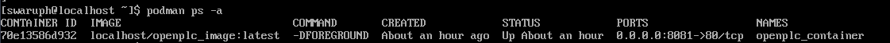
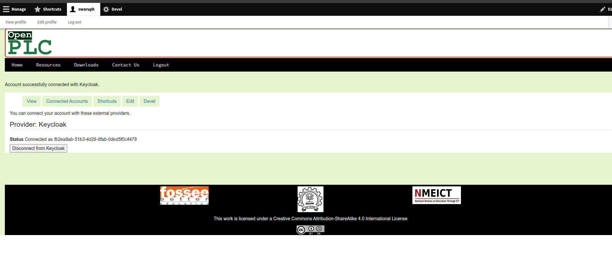

# Drupal Site with Keycloak SSO on Rocky Linux

This guide sets up Openplc(Drupal site) integrated with Keycloak for sso on Rocky Linux VM

## 1. Virtual Machine Setup

- Download the Rocky Linux iso image and a virtualization tool (eg VirtualBox)
- Create and complete the installation of the Rocky Linux VM.
- Set the VM's network adapter to Bridged Adapter for network accessibility from the host machine.

## 2. Install required dependencies

Update and configure firewall

```sh
sudo dnf update -y
sudo firewall-cmd --permanent --add-port=8080/tcp
sudo firewall-cmd --permanent --add-port=8081/tcp
```

Install MySQL

```sh
sudo dnf install mysql8.4-server
sudo systemctl start mysqld
sudo systemctl enable mysqld
sudo mysql_secure_installation
Press y|Y for Yes, any other key for No: n
Please set the password for root here.

New password:

Re-enter new password:

Remove anonymous users? (Press y|Y for Yes, any other key for No) : y
Success.

Disallow root login remotely? (Press y|Y for Yes, any other key for No) : y

Remove test database and access to it? (Press y|Y for Yes, any other key for No) : y

Reload privilege tables now? (Press y|Y for Yes, any other key for No) : y

All done!
```

Restart mysqld

```sh
sudo systemctl restart mysqld
# Try logging into mysql
mysql -u root -p
```

Install podman, jq and slirp4netns

```sh
sudo dnf install wget git podman jq slirp4netns -y
```

## 3. Setup project directory

Create a directory

```sh
mkdir openplc
cd openplc
# Download the following files
# Docker file
wget https://raw.githubusercontent.com/kjswaruph/fossee-daily-progress/refs/heads/main/openplc/Dockerfile
# init_sites script
wget https://raw.githubusercontent.com/kjswaruph/fossee-daily-progress/refs/heads/main/openplc/init_sites
# sites.json
wget https://raw.githubusercontent.com/kjswaruph/fossee-daily-progress/refs/heads/main/openplc/sites.json
```

- Add openplc.sql dump file

Run init_sites script

```sh
chmod +x init_sites
./init_sites
```

Enter the fields

```sh
Enter MySQL root password: {your_sql_root_password}
!! Kindly use lowercase for naming and don't include white spaces !!
Enter name of the site: openplc
Enter name of site database: openplcdb
Add date tag to database name? [default: _2025_10_10]:
Enter database username you wish to use: openplcuser
Enter path to SQL dumpfile for site: ./openplc.sql
Choose Drupal version for site (10, 11): 10
Enter branch name to clone: main

Is this information correct? (y/n): y

Do you want to create and use a new volume? [y/N]: y

Enter custom volume name [default: openplc_volume]:

Proceed with image build? (y/N): y

```

Check if container is running

```sh
podman ps
```



Create openplc user

```
podman exec -it openplc_container bash
chmod +x vendor/bin/drush
vendor/bin/drush cr # Reload cache
vendor/bin/drush user-create {your_username} --mail="{your_email}" --password="{your_password}"
vendor/bin/drush user-add-role "administrator" {your_username}
exit
```

## 4. Install keycloak

```
# Install java
sudo dnf install java-21-openjdk-devel -y
cd /opt
# Download the latest stable Keycloak (check keycloak.org/downloads for new versions)
sudo wget https://github.com/keycloak/keycloak/releases/download/26.4.0/keycloak-26.4.0.zip
sudo unzip keycloak-26.4.0.zip
sudo mv keycloak-26.4.0 keycloak

# Create a dedicated user for Keycloak
sudo groupadd keycloak
sudo useradd -r -g keycloak -d /opt/keycloak -s /sbin/nologin keycloak
sudo chown -R keycloak:keycloak /opt/keycloak

# Adjust SELinux context so that keycloak files can be executed without being blocked
sudo chcon -R -u system_u -t usr_t /opt/keycloak
```

Create database and user for keycloak:

```shell
# Login to MySQl
sudo mysql -u root -p

CREATE DATABASE keycloakdb CHARACTER SET utf8mb4 COLLATE utf8mb4_unicode_ci;
CREATE USER 'keycloakuser'@'localhost' IDENTIFIED BY 'your_password';
GRANT ALL PRIVILEGES ON keycloakdb.* TO 'keycloakuser'@'localhost';
FLUSH PRIVILEGES;
EXIT;
```

Download MySQL JDBC Driver and add it into keycloak

```sh
cd /opt/keycloak/providers
sudo wget https://repo1.maven.org/maven2/com/mysql/mysql-connector-j/8.4.0/mysql-connector-j-8.4.0.jar
sudo chown keycloak:keycloak mysql-connector-j-8.4.0.jar
# SELinux file context for provider JAR
sudo chcon -u system_u -t usr_t /opt/keycloak/providers/mysql-connector-j-8.4.0.jar
```

Edit `/opt/keycloak/conf/keycloak.conf`:

```shell
sudo vi /opt/keycloak/conf/keycloak.conf

# Update/add these lines

#Configure keycloak to use MySQL instead of H2
db=mysql
db-username=keycloakuser
db-password=your_password
db-url=jdbc:mysql://localhost:3306/keycloakdb

# Proxy & Hostname settings
proxy=edge
proxy-headers=xforwarded

hostname=your_ip_addr
http-enabled=true
https-enabled=false
http-port=8080
```

Create a temporary admin:

```sh
cd /opt/keycloak
sudo -u keycloak ./bin/kc.sh build
export P=your_password
sudo --preserve-env=P ./bin/kc.sh bootstrap-admin user --username admin --password:env P
```

> **Note**: This admin is temporary. After logging into the Admin Console, create a permanent admin user with the `admin` role, then remove the bootstrap user.

Build and verify

```shell
cd /opt/keycloak
sudo -u keycloak ./bin/kc.sh start --optimized
```

Create the service file `/etc/systemd/system/keycloak.service`:

```shell
[Unit]
Description=Keycloak Authorization Server
After=network.target

[Service]
Type=idle
User=keycloak
Group=keycloak
WorkingDirectory=/opt/keycloak
ExecStart=/opt/keycloak/bin/kc.sh start --optimized
LimitNOFILE=102400
LimitNPROC=102400
TimeoutStartSec=600
Restart=on-failure
RestartSec=30

[Install]
WantedBy=multi-user.target
```

Set correct owner and selinux file attributes.

```shell
sudo chcon -u system_u -t systemd_unit_file_t /etc/systemd/system/keycloak.service
sudo chown -R keycloak:keycloak /opt/keycloak
sudo chmod -R 755 /opt/keycloak

# Enable keycloak daemon service.
sudo systemctl daemon-reload
sudo systemctl enable --now keycloak
sudo systemctl status keycloak
```

## 5. Configure Drupal and Keycloak client

Drop into container and install open_id and keycloak modules

```
podman exec -it openplc_container bash
composer require drupal/openid_connect drupal/keycloak
# Enable modules using drush
vendor/bin/drush en openid_connect keycloak -y
exit
```

Drupal: Get Redirect URL

- Open your Drupal site.
- Login and navigate to Configuration > Web Services > OpenID Connect.
- Under Enabled OpenID Connect clients check the Keycloak
- Copy Redirect url given

Create keycloak client

- Open your Keycloak console at `http://{keycloak_domain}:8080`.
- Login and navigate to Clients > Create Client.
- General Settings: Set Client type to `OpenID Connect` and Client ID to `openplc`. Click Next.
- Capability config: Ensure Client authentication is On.
- Login settings: Paste the URL into Valid redirect URIs: `{redirect_url}`
  Hit Save.
- Navigate to the Credentials tab and Copy the Client secret.

Final Configuration

- Return to Drupal's Configuration > OpenID Connect.
  - Client ID: `openplc`
  - Client secret: `{client_secret}` // paste the secret copied from Keycloak.
  - Keycloak base url: `http://{keycloak_domain}:8080`
  - Keycloak realm: `master` (or your custom realm).
- Enable these options:

  - Replace Drupal login with Keycloak single sign-on (SSO)
  - Enable Drupal-initiated single sign-out
  - Enable Keycloak-initiated single sign-out

- Save configuration
- Navigate to User > View profile > Connected Accounts > Connect Keycloak to link your existing Drupal admin user to Keycloak.
- Logout from the Drupal site.



## 7. Test SSO

Rebuild drupal site cache

```sh
# Drop into container
podman exec -it openplc_container bash
# Refresh rebuild cache
vendor/bin/drush cr
exit
```

Login using SSO

- Logout from keycloak console
- Now open http://{openplc_domain}/user/login
- You should be redirected to keycloak console
- Login with your keycloak credentials
- On successful login you will be redirected back to Openplc site
